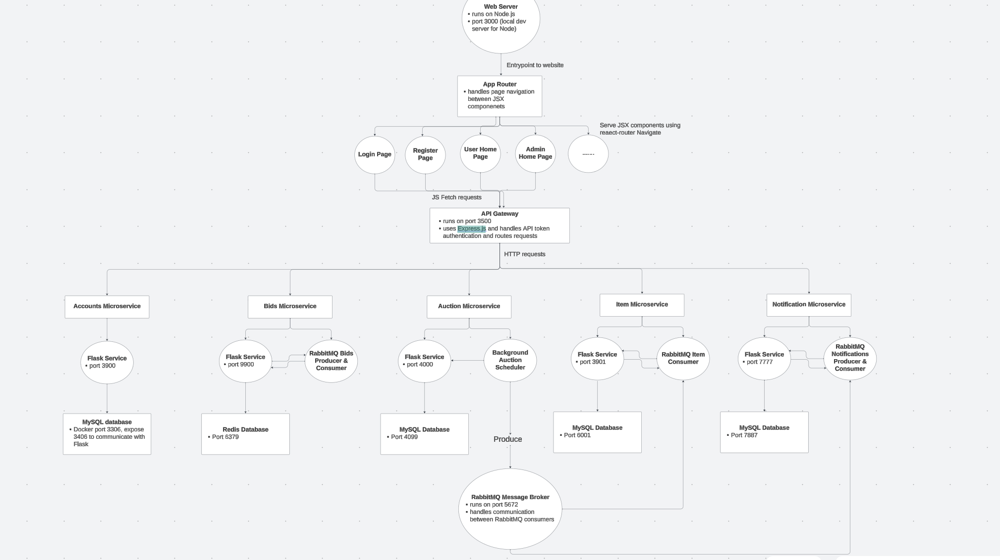

# Marketplace Application

## Building the Application

Architecture:

Technology Stack:

Frontend:
1. Node.js for serving the website
2. Express.js for the API Gateway
3. ReactJS / HTML / CSS for website pages

Backend:
1. Python - Flask
2. RabbitMQ for microservice communication

Databases:
1. MySQL - hosted in separate Docker containers (accounts, items, notifications, auctions)
2. Redis - hosted in Docker container (bidding)

## Running the Application
0. Download the repo and have Docker Desktop. In the root directory of this project locally, pip install microservices/requirements.txt
1. Run Docker Desktop App in your local machine
2. From a fresh terminal window, access the root directory of this project
3. Run: docker-compose build
4. Run: docker-compose up
5. Open a separate terminal and navigate to the same root directory
6. Run: bash start_application.sh
7. Acess a browser (chrome) window, and search: "http://localhost:3000"
